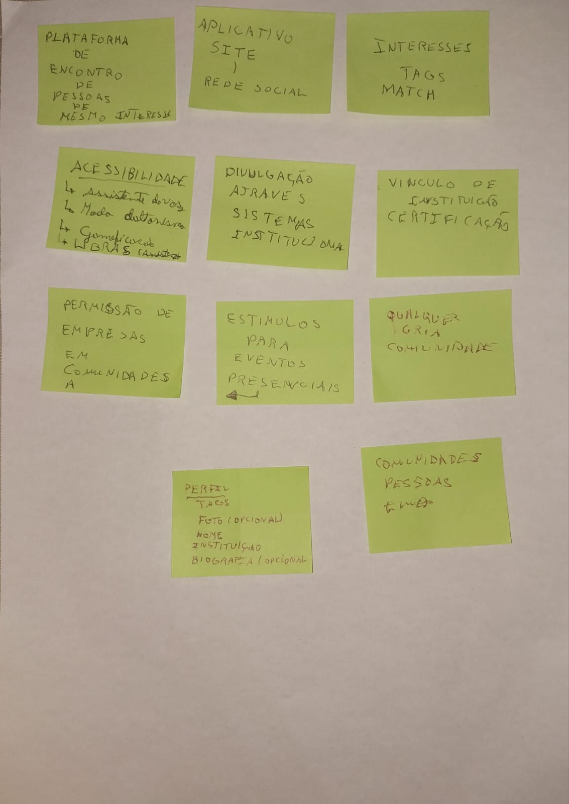

# UNDEFINED PROJECT NAME

## Descrição

O projeto consiste na criação de uma comunidade onde estudantes possam fazer networking com outros estudantes que possuem o mesmo interesse através de tags e um sistema de match baseado em interesses... A ideia é que o sistema tenha vínculo com instituições de ensino dos determinados estudantes e tragam algum benefício para o mesmo. 

O projeto foi desenvolvido e pensado no evento **VIII FÓRUM GEPIED EM DEBATE: INFORMÁTICA NA EDUCAÇÃO**	no subevento __Design Thinking__ com a Profª. Ma. Nadielli Galvão: Doutoranda PPGED - [GEPIED](https://gepied.org/)
### Autores (ideia)

Adailton Moura da Silva  
David Vieira Reis  
Dean Vinicius Palmeira de Meneses  
João Filipe de Araujo Santos Rezende  
Gabriel Chagas Melo Ribeiro  
Gustavo Santos Oliveira  
Lucas Santana de Jesus  

### Mídia

Brainstorm de Ideias de 5 minutos

Protótipo da síntese das ideias de 10 minutos
